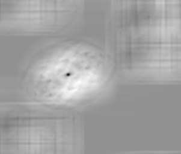
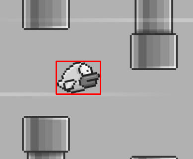

# OpenCV Match_Template HLS
## Tabela de Conteúdos
- [OpenCV Match\_Template HLS](#opencv-match_template-hls)
  - [Tabela de Conteúdos](#tabela-de-conteúdos)
  - [Informações Gerais](#informações-gerais)
  - [Estrutura do projeto](#estrutura-do-projeto)
  - [Como usar](#como-usar)
    - [Simulação](#simulação)
    - [Síntese](#síntese)

## Informações Gerais
  - Disponível no repositório: https://github.com/Isaac-CI/Exercicio2-processadores
  - Leia install.md e vitis_hls.md antes deste documento
  - O exemplo match_template do OpenCV foi adaptado de modo com que seja possível criar um design de um IP acelerador a partir do Vitis_HLS.
  - Aplica apenas o método da soma dos quadrados normalizada.
  -  A biblioteca vitis vision foi utilizada para auxiliar no fluxo de desenvolvimento
  -  Validação por meio de testbench anterior à geração do IP

## Estrutura do projeto
```
match_template/
├── Makefile 
├── hls_config.tmpl
├── src/
| ├── match_template.hpp
│ └── match_template.cpp
├── tb/
│ └── testbench.cpp
├── images/
│ ├── cropped1_128x128.png
| ├── cropped1.png
| ├── cropped3_128x128.png
│ └── cropped3.png
└── xf_config_params.h
```

## Como usar
### Simulação
Acesse o diretório `match_template/` e execute o seguinte comando: 
   ```
   $ make run -TARGET=csim -XPART=<sua_placa>
   ```
Se ainda não existir, a ferramenta irá criar um diretório `hls/` onde será possível encontrar as imagens resultantes do testbench.

Vale salientar que as constantes `INPUT_WIDTH`, `INPUT_HEIGHT`, `TEMPLATE_WIDTH` e `TEMPLATE_HEIGHT`, devem ser manualmente definidas de acordo com as dimensões das imagens utilizadas como input e template respectivamente.

As figuras a seguir ilustram o resultado obtido a partir do testbench.


**Figura 1: Imagem de entrada**


**Figura 1: Imagem template**




**Figura 1: Resultado do uso do IP**




**Figura 1: Área da imagem original selecionada pelo IP**

### Síntese
Acesse o diretório `match_template/` e execute o seguinte comando: 
   ```
   $ make run -TARGET=vivado_syn -XPART=<sua_placa>
   ```
Se ainda não existir, ferramenta irá criar um diretório `hls/` onde será possível acessar os relatórios e codigos RTL acerca do IP gerado, bem como o próprio IP.

É necessário destacar que se os valores das constantes `INPUT_WIDTH`, `INPUT_HEIGHT`, `TEMPLATE_WIDTH` e `TEMPLATE_HEIGHT` forem suficientemente altos, não será possível gerar o IP (ou ele irá demorar significativamente).